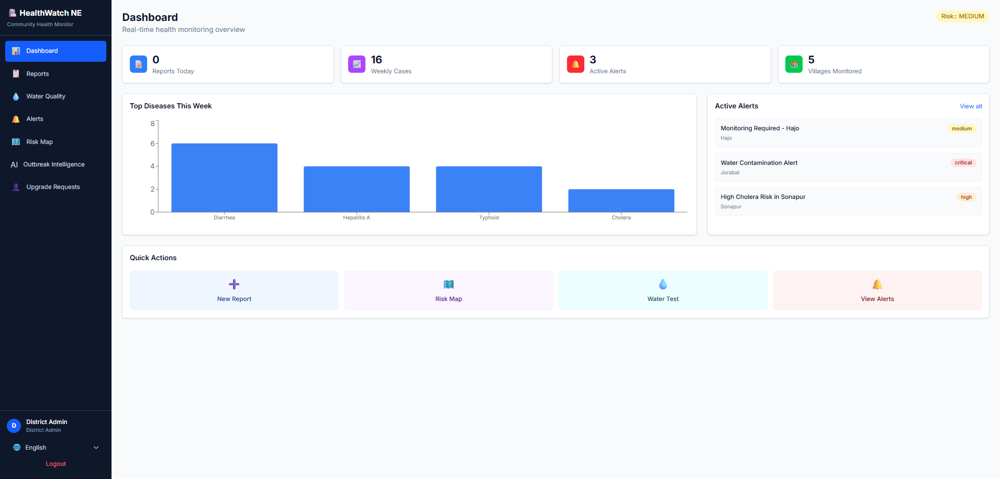
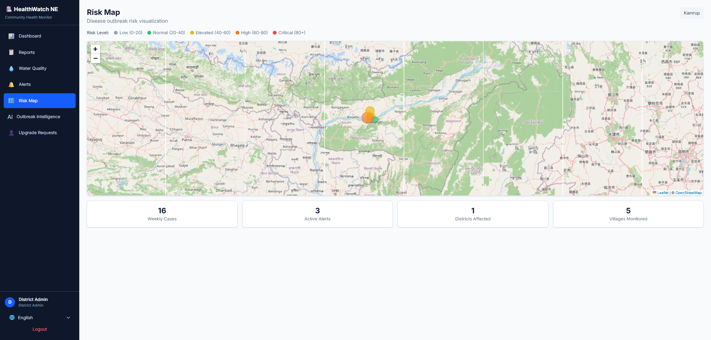
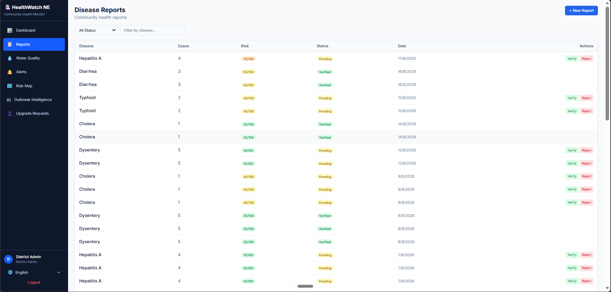
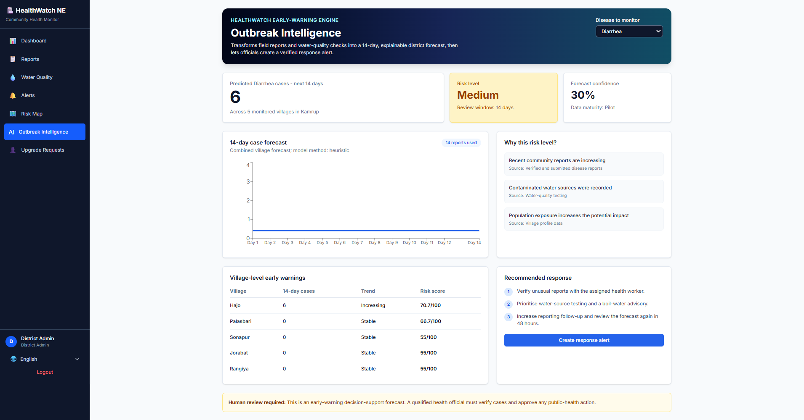
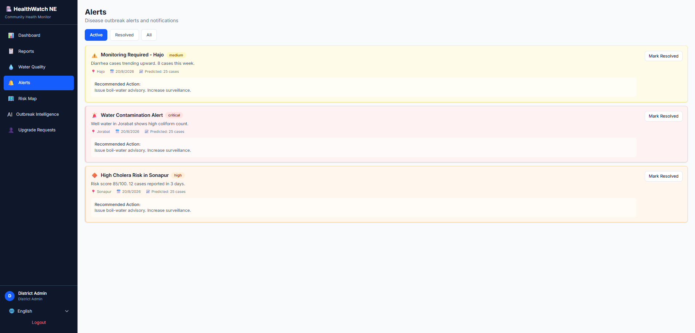
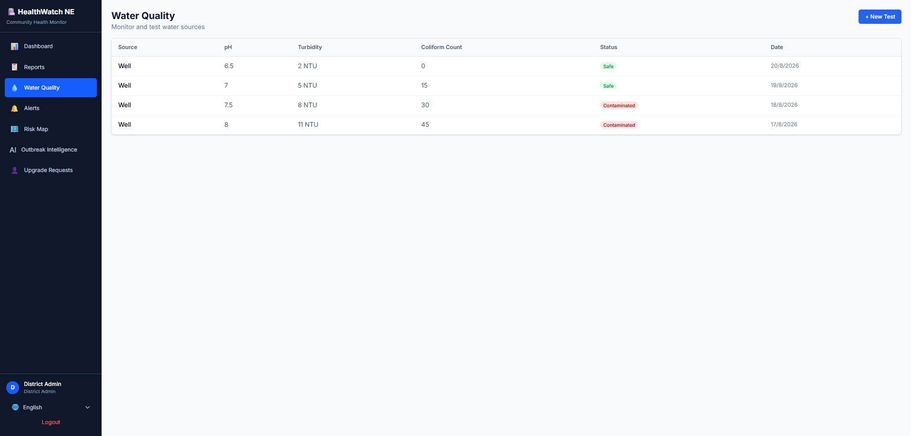

<div align="center">

# 🏥 HealthWatch NE

### Smart Community Health Monitoring & Early Warning System

**For Water-Borne Diseases in Rural Northeast India**

[]()
[]()
[]()
[]()
[]()

[](https://frontend-kappa-seven-26.vercel.app)
[](https://backend-production-da21.up.railway.app/api/docs)

</div>

---

## 📋 About the Project

Water-borne disease outbreaks remain a critical health threat in rural Northeast India, where limited infrastructure, delayed reporting, and lack of predictive tools allow diseases like cholera, typhoid, and hepatitis to spread unchecked.

**HealthWatch NE** is a full-stack web application that empowers community health workers to report disease cases in real-time, monitors water quality across villages, and uses machine learning to predict outbreaks before they escalate — all accessible in 6 regional languages on any device.

> Built for **Smart India Hackathon 2025** — Problem Statement `SIH25001`

---

## 🌐 Live Demo

| Service | URL |
|---------|-----|
| **Frontend** | [https://frontend-kappa-seven-26.vercel.app](https://frontend-kappa-seven-26.vercel.app) |
| **Backend API** | [https://backend-production-da21.up.railway.app](https://backend-production-da21.up.railway.app) |
| **API Documentation** | [https://backend-production-da21.up.railway.app/api/docs](https://backend-production-da21.up.railway.app/api/docs) |

### 🔑 Demo Accounts

| Role | Email | Password | Capabilities |
|------|-------|----------|-------------|
| **District Admin** | `admin@healthwatch.gov.in` | `admin123` | Full access, manage users, review upgrades |
| **ASHA Worker** | `priya@healthwatch.gov.in` | `worker123` | Verify reports, submit water tests, manage alerts |
| **Block Officer** | `arup@healthwatch.gov.in` | `officer123` | Review upgrades, resolve alerts, ML intelligence |
| **Volunteer** | `rahul@healthwatch.gov.in` | `volunteer123` | Submit disease reports, view dashboard |

---

## ✨ Key Features

<table>
<tr>
<td width="50%">

### 📝 Disease Reporting
Community health workers submit reports with geolocation, symptoms, severity, and water source — verified by staff before entering the system.

### 💧 Water Quality Monitoring
Track pH, turbidity, coliform count, dissolved oxygen, and nitrate levels across village water sources with contamination detection.

### 🤖 ML Outbreak Prediction
Holt's exponential smoothing + Random Forest ensemble predicts disease outbreaks 14 days ahead with confidence intervals and risk drivers.

### 🗺️ Interactive Risk Map
Leaflet-powered map with color-coded village markers showing real-time risk scores from 0-100 based on case density and water quality.

</td>
<td width="50%">

### 🔔 Real-Time Alerts
Auto-generated alerts when risk scores cross thresholds. Severity-based filtering, recommended actions, and one-click resolution.

### 📊 Analytics Dashboard
Live metrics — reports today, weekly trends, top diseases chart, active alerts, and villages monitored at a glance.

### 🌍 6-Language Support
English, Hindi, Bengali, Assamese, Marathi, and Tamil — zero-dependency custom i18n with 229+ translation keys.

### 🔐 Role-Based Access Control
4-tier access model (Volunteer → ASHA Worker → Block Officer → District Admin) with district-level data isolation and JWT authentication.

</td>
</tr>
</table>

---

## 📸 Screenshots

> Add your screenshots to a `screenshots/` folder at the project root.

<table>
<tr>
<td align="center">
<br>
<b>Dashboard</b>
</td>
<td align="center">
<br>
<b>Interactive Risk Map</b>
</td>
</tr>
<tr>
<td align="center">
<br>
<b>Disease Report Form</b>
</td>
<td align="center">
<br>
<b>ML Outbreak Intelligence</b>
</td>
</tr>
<tr>
<td align="center">
<br>
<b>Alert Management</b>
</td>
<td align="center">
<br>
<b>Water Quality Testing</b>
</td>
</tr>
</table>

---

## 🛠️ Tech Stack

### Frontend

| Technology | Purpose |
|-----------|---------|
| React 19 | UI framework |
| Vite 8 | Build tool & dev server |
| TailwindCSS 4 | Utility-first styling |
| React Router 7 | Client-side routing |
| Zustand | Lightweight state management |
| Axios | HTTP client with JWT interceptor |
| Recharts | Dashboard charts & graphs |
| Leaflet + React-Leaflet | Interactive risk maps |

### Backend

| Technology | Purpose |
|-----------|---------|
| FastAPI | High-performance async API framework |
| SQLAlchemy 2 | ORM with relationship mapping |
| PostgreSQL 16 | Production relational database |
| Redis 7 | Caching layer & rate limiting |
| python-jose | JWT token authentication |
| bcrypt | Password hashing |
| Pydantic v2 | Request/response validation |
| Loguru | Structured logging |

### Machine Learning

| Technology | Purpose |
|-----------|---------|
| scikit-learn | Random Forest regressor |
| NumPy | Numerical computation |
| joblib | Model serialization |
| Holt's Exponential Smoothing | Time-series forecasting |
| SES (Simple Exponential) | Baseline trend analysis |

### DevOps & Infrastructure

| Technology | Purpose |
|-----------|---------|
| Docker | Containerization |
| Kubernetes (GKE) | Production orchestration |
| Terraform | Infrastructure as Code |
| GitHub Actions | CI/CD pipeline |
| Railway | Backend hosting (current) |
| Vercel | Frontend hosting (current) |
| Nginx | Reverse proxy & rate limiting |

---

## 🏗️ Architecture

```
┌─────────────────────────────────────────────────────────┐
│                    CLIENT LAYER                         │
│  ┌──────────────┐  ┌──────────────┐  ┌──────────────┐  │
│  │  React SPA   │  │  Leaflet Map │  │  Recharts    │  │
│  │  (Vite)      │  │  (Risk Map)  │  │  (Dashboard) │  │
│  └──────┬───────┘  └──────────────┘  └──────────────┘  │
│         │ Axios + JWT                                   │
│         ▼                                               │
│  ┌──────────────────┐                                   │
│  │ Vercel (CDN)     │                                   │
│  └────────┬─────────┘                                   │
└───────────┼─────────────────────────────────────────────┘
            │ HTTPS
┌───────────▼─────────────────────────────────────────────┐
│                   SERVER LAYER                          │
│  ┌──────────────────────────────────────────────────┐   │
│  │ FastAPI (Railway)                                │   │
│  │  ┌─────────┐ ┌──────────┐ ┌──────────────────┐  │   │
│  │  │ Auth    │ │ Reports  │ │ Dashboard/Risk   │  │   │
│  │  │ (JWT)   │ │ (CRUD)   │ │ (Aggregation)    │  │   │
│  │  └─────────┘ └──────────┘ └──────────────────┘  │   │
│  │  ┌─────────┐ ┌──────────┐ ┌──────────────────┐  │   │
│  │  │ Alerts  │ │ Water    │ │ ML Predictor     │  │   │
│  │  │         │ │ Quality  │ │ (Holt + RF)      │  │   │
│  │  └─────────┘ └──────────┘ └──────────────────┘  │   │
│  └──────────────────────────────────────────────────┘   │
│         │                    │                          │
│  ┌──────▼──────┐    ┌───────▼────────┐                 │
│  │ PostgreSQL  │    │ Redis          │                 │
│  │ (Data)      │    │ (Cache/Rate)   │                 │
│  └─────────────┘    └────────────────┘                 │
└─────────────────────────────────────────────────────────┘
```

---

## 📁 Project Structure

```
HealthWatch-NE/
├── 📄 README.md
├── 🐳 Dockerfile                    # Railway deployment
├── 🐳 docker-compose.yml            # Local development (4 services)
├── ⚙️ railway.toml                  # Railway config
├── 🧪 test_smoke.py                 # 14 end-to-end tests
│
├── 📁 backend/
│   ├── 🐳 Dockerfile                # Multi-stage production build
│   ├── 📄 requirements.txt          # 19 Python dependencies
│   ├── 🌱 seed_data.py              # Demo data seeder
│   └── 📁 app/
│   │   ├── 🚀 main.py               # FastAPI entry point
│   │   ├── ⚙️ config.py             # Pydantic settings
│   │   ├── 🗄️ database.py          # SQLAlchemy engine
│   │   ├── 📁 models/              # 7 SQLAlchemy models
│   │   ├── 📁 schemas/             # 18 Pydantic schemas
│   │   ├── 📁 routes/              # 7 route modules (20+ endpoints)
│   │   ├── 📁 services/            # Health scoring, caching
│   │   ├── 📁 middleware/          # JWT auth, rate limiter
│   │   └── 📁 ml/                  # ML forecasting & prediction
│
├── 📁 frontend/
│   ├── 📄 vercel.json               # Vercel deployment
│   ├── 📄 package.json              # 12 runtime dependencies
│   └── 📁 src/
│       ├── 📁 components/           # Layout, LanguageSelector
│       ├── 📁 pages/                # 10 page components
│       ├── 📁 store/                # Zustand auth store
│       ├── 📁 utils/                # Axios API client
│       └── 📁 i18n/locales/         # 6 language files (229+ keys)
│
├── 📁 docs/
│   └── 📄 JUDGE_DEMO.md            # 3-minute SIH demo script
│
├── 📁 k8s/                          # Kubernetes manifests (7 files)
├── 📁 gcp/                          # Terraform + Cloud Build
├── 📁 nginx/                        # Production reverse proxy
└── 📁 .github/workflows/            # CI/CD pipeline
```

---

## 🚀 Getting Started

### Prerequisites

- **Node.js** 18+ and npm
- **Python** 3.12+
- **PostgreSQL** 16+ (or Docker)
- **Redis** 7+ (optional, falls back to in-memory)

### Option A: Docker Compose (Recommended)

```bash
# Clone the repository
git clone https://github.com/ayankunduixb-pixel/SIH-Hackathon.git
cd SIH-Hackathon

# Start all services (PostgreSQL, Redis, Backend, Frontend)
docker compose up --build
```

The database is seeded automatically with demo data on first start.

- Frontend: `http://localhost:5173`
- Backend API: `http://localhost:8000`
- API Docs: `http://localhost:8000/api/docs`

### Option B: Manual Setup

```bash
# Backend
cd backend
python -m pip install -r requirements.txt
python -m uvicorn app.main:app --reload --host 0.0.0.0 --port 8000

# Seed database (optional)
python seed_data.py

# Frontend (new terminal)
cd frontend
npm install
npm run dev
```

### Option C: SQLite (No Database Setup)

```bash
cd backend
python -m pip install -r requirements.txt
.\run_local.ps1    # Windows PowerShell
```

### 🗃️ Reset Development Database

```bash
$env:RESET_DATABASE = "true"
docker compose up --build
```

---

## 📡 API Overview

| Method | Endpoint | Auth | Description |
|--------|----------|------|-------------|
| `POST` | `/api/auth/register` | — | Create volunteer account |
| `POST` | `/api/auth/login` | — | Login, get JWT token |
| `GET` | `/api/auth/me` | ✅ | Current user profile |
| `POST` | `/api/auth/request-upgrade` | ✅ | Request role upgrade |
| `GET` | `/api/auth/upgrade-requests` | ✅ | List upgrade requests |
| `PUT` | `/api/auth/upgrade-requests/{id}` | ✅ | Approve/reject upgrade |
| `POST` | `/api/reports` | ✅ | Submit disease report |
| `GET` | `/api/reports` | ✅ | List reports (district-scoped) |
| `PUT` | `/api/reports/{id}/status` | ✅ | Verify/reject report |
| `POST` | `/api/water-quality` | ✅ | Submit water test |
| `GET` | `/api/water-quality` | ✅ | List water tests |
| `POST` | `/api/alerts` | ✅ | Create alert |
| `GET` | `/api/alerts` | ✅ | List alerts |
| `PUT` | `/api/alerts/{id}/resolve` | ✅ | Resolve alert |
| `GET` | `/api/dashboard/summary` | ✅ | Dashboard metrics |
| `GET` | `/api/dashboard/risk-map` | ✅ | Village risk data |
| `GET` | `/api/dashboard/predictions/{district}/{disease}` | ✅ | ML prediction |
| `GET` | `/api/dashboard/trends/{village_id}/{disease}` | ✅ | Disease trends |
| `GET` | `/api/villages` | ✅ | List villages |
| `GET` | `/api/locations/reverse` | ✅ | Reverse geocoding |
| `GET` | `/api/health` | — | Health check |

---

## 🗄️ Database Schema

| Model | Table | Key Fields |
|-------|-------|------------|
| **User** | `users` | UUID id, name, email, role (enum), district, coordinates |
| **Village** | `villages` | UUID id, name, block, district, population, coordinates |
| **DiseaseReport** | `disease_reports` | reporter_id, village_id, disease_type, symptoms (JSON), severity, risk_score |
| **WaterQuality** | `water_quality` | village_id, tested_by, ph, turbidity, coliform, is_contaminated |
| **Alert** | `alerts` | title, severity, affected_area, predicted_cases, is_resolved |
| **RoleUpgradeRequest** | `role_upgrade_requests` | user_id, current_role, requested_role, justification, status |
| **OutbreakPrediction** | `outbreak_predictions` | district, disease_type, predicted_cases, confidence, factors (JSON) |

---

## 🔐 Role-Based Access Control

| Feature | Volunteer | ASHA Worker | Block Officer | District Admin |
|---------|:---------:|:-----------:|:-------------:|:--------------:|
| Submit disease reports | ✅ | ✅ | ❌ | ❌ |
| View reports | ✅ | ✅ | ✅ | ✅ |
| Verify/reject reports | ❌ | ✅ | ✅ | ✅ |
| Submit water tests | ❌ | ✅ | ✅ | ❌ |
| View water tests | ❌ | ✅ | ✅ | ✅ |
| Create alerts | ❌ | ❌ | ✅ | ✅ |
| Resolve alerts | ❌ | ❌ | ✅ | ✅ |
| ML Intelligence | ❌ | ❌ | ✅ | ✅ |
| Review upgrade requests | ❌ | ❌ | ✅ | ✅ |
| Dashboard analytics | ✅ | ✅ | ✅ | ✅ |
| Risk map | ✅ | ✅ | ✅ | ✅ |

---

## 🌍 Internationalization

| Code | Language | Native Name |
|------|----------|-------------|
| `en` | English | English |
| `hi` | Hindi | हिन्दी |
| `bn` | Bengali | বাংলা |
| `as` | Assamese | অসমীয়া |
| `mr` | Marathi | मराठी |
| `ta` | Tamil | தமிழ் |

> 229+ translation keys covering all UI sections. Custom zero-dependency i18n — no external libraries needed.

---

## 🚢 Deployment

### Current Production

| Service | Platform | URL |
|---------|----------|-----|
| Backend | Railway | [backend-production-da21.up.railway.app](https://backend-production-da21.up.railway.app) |
| Frontend | Vercel | [frontend-kappa-seven-26.vercel.app](https://frontend-kappa-seven-26.vercel.app) |
| Database | Railway PostgreSQL | Managed |

### Production Infrastructure (GKE)

The repository includes full Kubernetes and Terraform configuration for Google Cloud Platform deployment:

- **Terraform**: VPC, GKE cluster, Cloud SQL PostgreSQL, Memorystore Redis
- **Kubernetes**: 7 manifests with autoscaling (2-12 pods), health probes, ingress
- **CI/CD**: GitHub Actions pipeline (test → build → deploy)
- **Nginx**: Production reverse proxy with rate limiting and security headers

See [`docs/DEPLOYMENT.md`](.github/DEPLOYMENT.md) for GKE deployment guide.

---

## 🧪 Testing

```bash
# Run the 14 end-to-end smoke tests
cd backend
python -m pytest ../test_smoke.py -v
```

Tests cover: auth flow, report CRUD, water quality, alerts, dashboard, ML predictions, RBAC enforcement, and database integrity.

---

## 🤝 Contributing

1. Fork the repository
2. Create a feature branch (`git checkout -b feature/amazing-feature`)
3. Commit changes (`git commit -m 'Add amazing feature'`)
4. Push to branch (`git push origin feature/amazing-feature`)
5. Open a Pull Request

---

## 📄 License

This project is licensed under the MIT License — see the [LICENSE](LICENSE) file for details.

---

## 🙏 Acknowledgements

- **Smart India Hackathon 2025** — Problem Statement SIH25001
- **OpenStreetMap** — Map tile data for Leaflet risk maps
- **Nominatim** — Reverse geocoding services
- All the community health workers of Northeast India who inspired this project

---

<div align="center">

**Built with ❤️ for the communities of Northeast India**

[⬆ Back to Top](#-healthwatch-ne)

</div>
